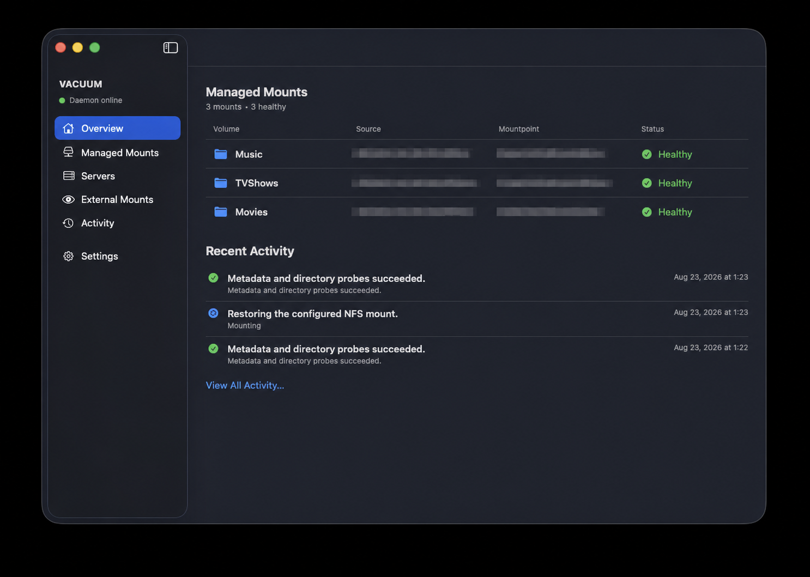

# LATCH

LATCH (LAN Automount, Tracking, Connection & Health) keeps NFS volumes available on macOS without constant supervision. This native menu-bar app brings server discovery, mount management, health monitoring, and safe recovery into one focused control center for Macs that depend on NAS storage.



## Core features

- **Automatic mount management.** LATCH restores configured volumes after login, wake, and network changes, with retry handling for temporarily unavailable servers.
- **Conservative health monitoring and recovery.** Native, read-only probes distinguish a confirmed stale NFS mount from unrelated failures. Automatic recovery runs only for numeric `ESTALE` results and verifies the exact source before and after the remount.
- **Network-aware server access.** Bonjour discovery helps find NFS servers, network rules control where mounts are available, and optional Wake-on-LAN can bring a sleeping server online before mounting.
- **Dependency-aware recovery.** LATCH can coordinate Docker containers and macOS applications around a remount, stopping them in order and restarting only the processes that were previously running.
- **At-a-glance operations.** The Overview, Managed Mounts, Servers, External Mounts, and Activity views make health, recovery state, and recent events easy to inspect.
- **Privileged operations with a narrow trust boundary.** A root LaunchDaemon owns configuration and mount operations, while signed XPC connections, fixed executables, and typed requests keep the GUI out of the root context.
- **Non-invasive external mount visibility.** NFS mounts that LATCH does not manage remain read-only observations; the app never imports, probes, unmounts, or changes them.

## Build and test

Requirements: macOS 15 or later and Xcode 26.6. The native `LATCH.xcodeproj` is the authoritative build graph; the Makefile provides the repeatable command-line orchestration around `xcodebuild`.

```bash
make help
make test
make test FILTER=XPCTests
make app
make dmg APP=dist/LATCH.app DMG=dist/LATCH.dmg
make check
```

`make app` builds the Xcode `LATCH` scheme and stages its signed product at `dist/LATCH.app`. Pass `CONFIG=release` to stage an optimized Development-signed bundle. `make build` leaves the product in Xcode derived data when you only need a compiled target.

`make dmg` packages an already built `dist/LATCH.app` into `dist/LATCH.dmg` for local distribution. Override `APP` or `DMG` to choose a different source app or output path.

```bash
make app CONFIG=release
make release \
  SIGNING_IDENTITY="Developer ID Application: Example Company (TEAMID1234)" \
  TEAM_ID=TEAMID1234
make notarize NOTARY_PROFILE=LATCHNotary
```

Use `make clean` to remove Xcode derived data products. `make release` performs a fresh Release Xcode build with the supplied Developer ID identity and stages that exact product. Developer ID signing and notarization remain required for distribution and stable production authorization.

For local development, open `LATCH.xcodeproj` in Xcode, select the `LATCH` scheme, and select your Apple ID's free Personal Team under **Signing & Capabilities**. Automatic signing then installs a Development-signed app on the Mac. The same team selection is used by `make app` and `make test`; it does not grant distribution or privileged-service authorization.

Copy the finished `dist/LATCH.app` to `/Applications`, launch it, and open Settings. Install the privileged daemon and login agent separately. If macOS requires approval, the app offers to open **System Settings > General > Login Items & Extensions**; enable the LATCH items there. Settings also lets you unregister either service without deleting mount definitions or state.

When adding a mount, enter the NAS export path exactly as the server advertises it, then use **Choose Folder** for the local target. The picker opens in your home folder, suggests `~/MountName`, and lets you create that folder. The app accepts only an existing, empty, owned directory and never creates a missing path during a mount operation. Select **Verify Network Volumes** only after at least one app-managed NFS volume is mounted. Automatic recovery remains disabled until that registered-daemon probe succeeds.

## Safety model

- The app sends versioned typed requests over XPC and never runs as root.
- XPC peers must satisfy a Team ID and bundle-identifier signing requirement.
- The daemon invokes only fixed executables with fixed argument arrays; no shell text or arbitrary options are accepted.
- The probe reports numeric errno values. Only `ESTALE` enables automatic recovery.
- Recovery verifies the exact source before unmounting and after remounting.
- Configured dependencies stop in order and restart in reverse order only if they were previously running.
- Any failure after dependencies stop enters `failedClosed` and leaves them stopped.

## Configuration

The daemon stores root-owned configuration at:

```text
/Library/Application Support/LATCH/config.json
```

The JSON file is mode `0600`, written atomically, and backed by `config.last-known-good.json`. Edit configuration only through the app.

## Manual cleanup of a pre-migration install

Use this reset only when replacing an installation that used the legacy VACUUM product. Before installing a new build, confirm legacy VACUUM launchd services are absent; a successful `launchctl print` for either label means the old installation still owns that service. The migration is a clean break: VACUUM service labels must be removed by the user before enabling LATCH.

```bash
launchctl print system/com.github.letsrokk.vacuum.daemon
launchctl print gui/$(id -u)/com.github.letsrokk.vacuum.agent
launchctl print system/com.github.letsrokk.latch.daemon
launchctl print gui/$(id -u)/com.github.letsrokk.latch.agent
defaults delete local.latch
defaults delete com.github.letsrokk.latch.shared
```

Run the `launchctl print` commands again after cleanup. Removing `/Library/Application Support/LATCH` is optional and destructive because it deletes root-owned configuration and state. Decide that separately and remove it manually only after preserving any configuration you need; no build or system-test command automates this removal. Preserve that directory during normal development and testing.

## System verification

Unit tests do not replace signed service-context testing. Follow [docs/system-test-checklist.md](docs/system-test-checklist.md) before enabling automatic recovery on production mounts.
